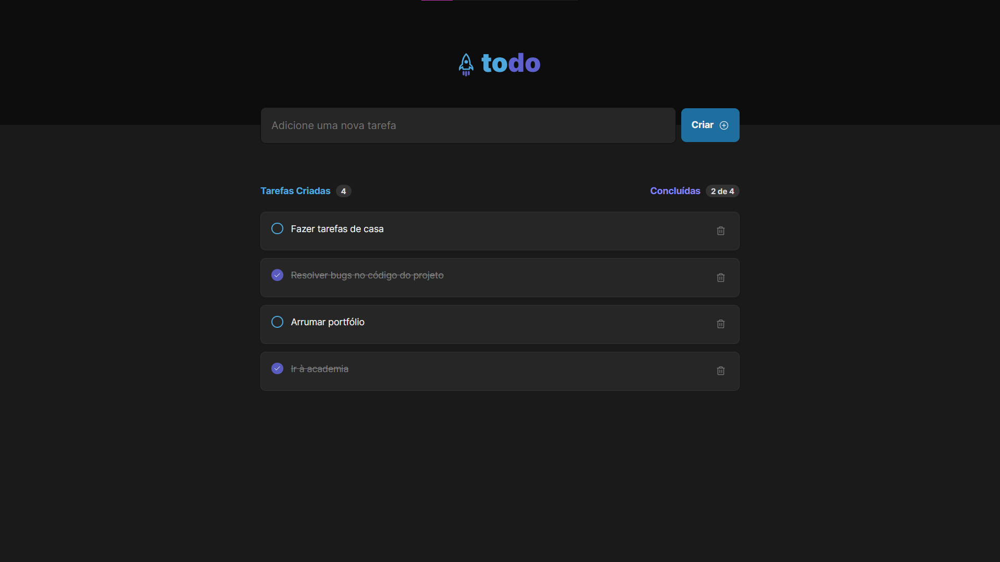

<h1 align="center">
  Desafio ToDo List ReactJS
</h1>
<h3 align="center"> 
  🚧  Finalizado  🚧
</h3>

<!-- <h3 align="center">desafio-react-todolist</h3> -->

<div align="center">


[](https://vercel.com/imyudzs-projects/desafio-react-todolist)

</div>

---

## 🧭 Navegação
- [🧭 Navegação](#-navegação)
- [📁 Acesso ao projeto](#-acesso-ao-projeto)
- [📝 Sobre o desafio  ](#-sobre-o-desafio--)
- [🛠️ Abrir e rodar o projeto ](#️-abrir-e-rodar-o-projeto-)
  - [Pré Requisitos](#pré-requisitos)
  - [Instalações](#instalações)
- [⛏️ Tecnologias Utilizadas ](#️-tecnologias-utilizadas-)
- [✍️ Autores ](#️-autores-)

<br>

## 📁 Acesso ao projeto
Para acessar o projeto, você pode:

1. Baixar o projeto clicando [aqui](https://github.com/imyudz/desafio-react-todolist.git)
2. Acessar diretamente pelo link de público [aqui](https://vercel.com/imyudzs-projects/desafio-react-todolist)

<br>

## 📝 Sobre o desafio  <a name = "sobre"></a>
<p align="center">
  <a href="" rel="noopener">
 </a>
</p>
<p>
Neste desafio, foi necessário desenvolver uma aplicação de controle de tarefas no estilo **to-do list**, que contém as seguintes funcionalidades:

- `Adicionar uma nova tarefa`
- ``Marcar e desmarcar uma tarefa como concluída``
- ``Remover uma tarefa da listagem``
- `Mostrar o progresso de conclusão das tarefas`
    <br> 
</p>


## 🛠️ Abrir e rodar o projeto <a name = "getting_started"></a>

Para poder ter uma versão do projeto rodando localmente na sua máquina, siga as seguintes instruções

### Pré Requisitos

Antes de tudo, tenha certeza de ter instalado em sua máquina o Node.js
  - [Node.js](https://nodejs.org/en/download/)


### Instalações

Após ter todos os pré requisitos, pode seguir com os seguintes passos:

**1. Clone o repositório para a sua máquina local usando:**
  ```
  git clone https://github.com/imyudz/desafio-react-todolist.git
  ```

**2. Navegue até a pasta do projeto usando:** 
  ```
  cd desafio-react-todolist/
  ```

**3. Instale as dependências do projeto com o comando:**
  ```
  npm install
  ```

**4. Rode a aplicação com o comando::**
  ```
  npm run dev
  ```

Se tudo ocorrer bem, você poderá abrir o navegador e acessar a aplicação em `http://localhost:5173`

## ⛏️ Tecnologias Utilizadas <a name = "built_using"></a>

- [ReactJS](https://reactjs.org/) - Web Framework
- [Vite](https://vitejs.dev/) - Build Tool / Development Server
- [Phosphor React](https://github.com/phosphor-icons/phosphor-react) - Icon Component Library
- [ESLint](https://eslint.org/) - Linter Tool
- [TypeScript](https://www.typescriptlang.org/) - Static Type Checker para JavaScript


## ✍️ Autores <a name = "authors"></a>

| [ <br><sub>Victor Henri S. Vargas</sub>](https://github.com/imyudz) |
| :---: |
